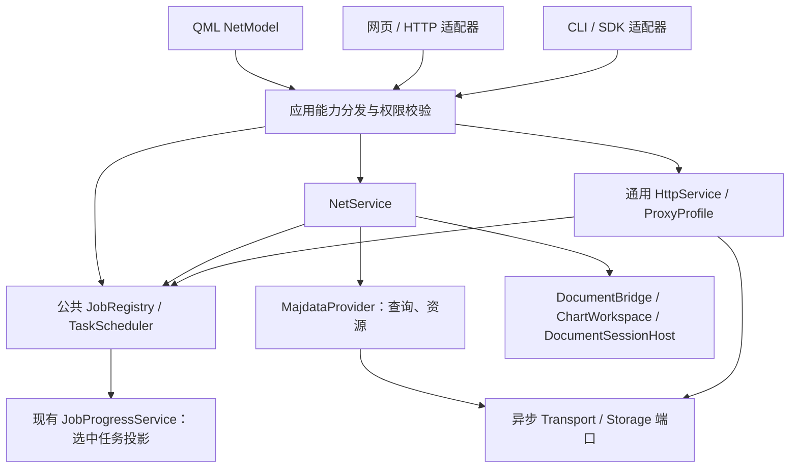

# Net 与通用网络 API 规范（1.0 实施契约）

本文规定桌面 v2 的 Net 应用接口。机器契约登记 34 个操作并生成 Schema、OpenAPI 和 SDK 类型；本文操作目录列出 29 项，其中下载、预览、查询、文档快照及任务基础共 15 个操作接入桌面宿主内部，QML 页面通过公共分发器调用。HTTP 与 CLI 适配器按照目录中的 capability 状态管理。当前实现状态与新增能力规则见 [规范化计划](NET_API_STANDARDIZATION_PLAN_ZH.md)，操作说明见 [生成操作目录](generated/NET_OPERATION_CATALOG_ZH.md) 和 [OpenAPI](generated/net-openapi.json)。调查事实与来源提交见 [迁移评估](NET_MIGRATION_ASSESSMENT_ZH.md)，完成标准见 [验收清单](../../tests/NET_MIGRATION_TEST_CHECKLIST_ZH.md)。

文中的“必须”是新接口实施和验收的要求。“建议”是可在实现前调整的默认策略；调整后应同时更新 schema、示例与验收。本文不改变 Majdata 服务端协议。

## 1. 一个业务契约，多种调用方式

`net.*` 表示在线谱面业务，以 `providerId` 区分 Majdata 和后续平台；`network.*` 表示通用 HTTP 和代理。新功能应注册到同一应用能力目录，分别路由到自己的领域服务。文档、播放、分析和导出也可沿用这一注册/任务模式，不把它们的业务逻辑塞入 NetService。



引擎和 provider 位于 `media_tools/net`，装配和领域用例位于 `app/services`/`app/runtime`，QML 投影位于 `app/ui/net`。JobRegistry、NetService、ApiCatalog/ApiDispatcher 与查询 provider 已接入；文件、通用网络与公共适配器继续按计划实现。UI、HTTP、CLI 可以有不同展示，但过滤、取消、重试、文件规则和结果码必须一致。新增页面使用现有标签页。

JobRegistry/调度放在拟定的 app/services/jobs，供 Net 与通用网络共享；能力分发放在 app/services/api。服务只依赖不含触网对象的 typed port/DTO，ApplicationServices 保持 Core/Gui 装配闭包。Bootstrap/runtime 构造生产网络、凭据和 HTTP adapter 并安装/撤销槽位；文档操作通过 services/DocumentBridge 和运行时宿主，服务不包含 UI。

每个公开操作在能力注册表中必须声明：稳定 operationId、领域 owner、请求/结果 schema、权限、同步/异步、平台可用性、是否变更资源、幂等规则、脱敏字段、引入/弃用版本和验收 ID。HTTP 路由、CLI 命令、SDK 类型与说明从该表生成或做集合校验。不能存在已暴露而无 schema 的处理器，也不能把归档 fixture 当成当前 capability。

## 2. 基础协议与兼容性

- HTTP 基路径为 `/api/v1`；UTF-8 JSON；具体协议版本 `apiVersion: "1.0"`。应用版本、provider 协议版本与 API 版本分别报告。
- 同步成功 HTTP 200；创建异步任务 HTTP 202，并返回 jobId。202 只表示接收成功；调用者必须检查任务终态。
- 成功 envelope 固定为 `{apiVersion, requestId, ok:true, result, meta?}`；失败为 `{apiVersion, requestId, ok:false, error}`。
- 请求头 `X-Request-Id` 可由客户端给出（1–128 个 ASCII 字符，模式 `[A-Za-z0-9_.:-]+`），缺省由宿主生成；用于追踪，不承担去重。Idempotency-Key 使用相同字符规则。不得含凭据。
- 所有 64 位整数（包括 revision、generation、任务 version、sequence、累计字节）使用十进制字符串；避免 JavaScript 数字精度损失。有限的批次项数、HTTP 状态和毫秒参数用 schema 限制范围的 JSON 整数。日期使用 ISO 8601，时刻统一 UTC 的 `Z` 格式。
- ID 是不透明引用，禁止从 jobId/artifactRef 推导本机路径或访问另一客户端的资源。
- 未声明请求字段与非法 enum 返回 `request.invalid`；可选字段缺省应用 schema 默认值；null 只有 schema 明确允许时可用。响应可新增可选字段，客户端应忽略未知字段。
- 增加可选字段/操作提升 minor；删除或改变字段、权限、默认语义、状态含义使用新 major。建议弃用窗口至少两个 minor 且 90 天，并在 capability 中给出 replacement 和 sunset。
- 旧式 v1 扩展同步结果 `{ok,value,error}` 如需兼容，只在独立兼容适配器转换；异步操作必须返回任务引用。任务完成状态通过 JobSnapshot 查询。

成功接收示例：

```json
{
  "apiVersion": "1.0",
  "requestId": "download-001",
  "ok": true,
  "result": {"jobId": "job_abc", "kind": "net.download", "state": "queued"}
}
```

错误示例：

```json
{
  "apiVersion": "1.0",
  "requestId": "query-001",
  "ok": false,
  "error": {
    "code": "upstream.rate_limited",
    "message": "The provider requested a delay.",
    "retryable": true,
    "upstreamStatus": 429,
    "retryAfterMs": 12000,
    "diagnosticId": "diag_xyz"
  }
}
```

本协议使用自定义 error envelope；不声称其是 RFC 9457 Problem Details。

## 3. 第一版操作目录

除两个配对引导操作外，HTTP 均要求应用 bearer、主体所有权和列出的权限。QML/CLI 经宿主身份和授权策略调用同一分发器。结果中的文件、任务引用仍需授权校验。

| Operation ID | HTTP（相对 /api/v1） | 权限 | 请求 → 结果 |
| --- | --- | --- | --- |
| `api.capabilities` | GET `/capabilities` | api.read | — → CapabilitySet |
| `net.providers.list` | GET `/net/providers` | net.read | — → ProviderDescriptor[] |
| `net.probes.create` | POST `/net/probes` | net.read | ProviderRequest → JobHandle（202 异步） |
| `net.queries.create` | POST `/net/queries` | net.read | ChartQueryRequest → JobHandle（202 异步） |
| `net.queries.results` | GET `/net/queries/{queryRef}` | net.read | QueryPageRequest → ChartPage |
| `net.downloads.create` | POST `/net/downloads` | net.download + files.write | DownloadRequest → JobHandle（202 异步） |
| `net.previews.prepare` | POST `/net/previews` | net.preview | PreviewPrepareRequest → JobHandle（202 异步） |
| `net.previews.open` | POST `/net/previews/{previewRef}/open` | net.preview + document.replace | PreviewOpenRequest → JobHandle（202 异步） |
| `net.previews.release` | DELETE `/net/previews/{previewRef}` | net.preview | — → ReleaseResult |
| `document.snapshot` | GET `/document/snapshot` | document.read | — → DocumentIdentity |
| `net.settings.get` | GET `/net/settings` | net.settings.read | — → NetSettings |
| `net.settings.update` | PATCH `/net/settings` | net.settings.write | NetSettingsPatch → NetSettings |
| `jobs.list` | GET `/jobs` | jobs.read | JobListRequest → JobPage |
| `jobs.get` | GET `/jobs/{jobId}` | jobs.read | — → JobSnapshot |
| `jobs.items` | GET `/jobs/{jobId}/items` | jobs.read | ItemPageRequest → ItemPage |
| `jobs.events` | GET `/jobs/{jobId}/events` | jobs.read | EventPageRequest → EventPage |
| `jobs.cancel` | POST `/jobs/{jobId}/cancel` | jobs.control | — → JobSnapshot |
| `jobs.resume` | POST `/jobs/{jobId}/resume` | jobs.control + 原业务权限 | ResumeRequest → JobSnapshot |
| `jobs.retry` | POST `/jobs/{jobId}/retry` | jobs.control + 原业务权限 | RetryRequest → JobHandle（202 异步） |
| `jobs.diagnostics` | GET `/jobs/{jobId}/diagnostics` | jobs.read + diagnostics.read | — → DiagnosticSummary |
| `files.grants.request` | POST `/files/grants` | files.read 或 files.write | FileGrantRequest → JobHandle（202 异步） |
| `files.artifacts.content` | GET `/files/artifacts/{artifactRef}/content` | files.read | — → BinaryContent |
| `network.targets.request` | POST `/network/target-grants` | network.targets.manage | TargetGrantRequest → JobHandle（202 异步） |
| `network.http.fetch` | POST `/network/fetch` | network.http + 目标授权 | HttpFetchRequest → JobHandle（202 异步） |
| `network.http.download` | POST `/network/downloads` | network.http + files.write + 目标授权 | HttpDownloadRequest → JobHandle（202 异步） |
| `network.proxy.get` | GET `/network/proxy/{profileId}` | network.proxy.read | — → ProxyProfile |
| `network.proxy.set` | PUT `/network/proxy/{profileId}` | network.proxy.manage | ProxyProfileRequest → JobHandle（202 异步） |
| `gateway.pairings.create` | POST `/pairings` | 临时配对窗口 | PairingRequest → PairingChallenge |
| `gateway.pairings.exchange` | POST `/pairings/{pairingRef}/exchange` | 配对 secret + Origin | PairingExchangeRequest → PairingResult |

`jobs.retry` 继承原下载、预览及文件权限。取消与查询仅作用于授权任务，诊断需额外权限。二进制下载成功返回文件内容和 Content-Type/Content-Length/Content-Disposition；失败仍返回 JSON envelope，不将 HTML 错误页当成文件。

权威操作目录为 `tools/net-api/operations.json`，Schema 为 `tools/net-api/schemas.json`。C++ 内嵌目录、OpenAPI、SDK 类型及操作说明由 `scripts/api/generate_net_api.py` 生成并核对。[机读清单](net-migration-inventory.json) 保留历史调查与功能/验收映射（inventory_only），不用于报告当前处理器可用性。

文件/目标授权和预览打开等需要桌面交互的操作，应返回任务并处于 awaiting_user。通过现有 UiRequestService/文档 continuation 取得选择；拒绝或关闭产生 cancelled。无 UI 的运行形态返回 capability 不可用或明确的 `interaction.required`，不能默默通过保护。

## 4. DTO 与请求语义

### 4.1 通用数据类型

| 类型 | 必需字段与规则 |
| --- | --- |
| ProviderDescriptor | providerId、协议适配版本、supportedOperations、资源类型、limits；当前未支持明确 available=false 和 reason |
| CapabilitySet | apiVersion、hostInstanceId、applicationVersion、platform、timeZone、operations（id/available/scopes/schemaVersions/reason）、limits；只列当前主体可见信息 |
| ChartSummary | providerId、chartId、title、artist、designer、uploader、levels[]、tags[]、uploadedAtUtc、remoteVersion（可空）；remoteVersion 是版本提示 |
| JobHandle | jobId、kind、state；可选 parentJobId；已接收的具体任务 |
| DocumentIdentity | workspaceId、documentOpenGeneration、revision、dirty、hasDocument、origin；不暴露完整路径或源码 |
| ResourceManifest | providerId、chartId、remoteVersion、resources[]；每项 kind、state、artifactRef/relativeName、bytes、contentType、校验信息 |
| ArtifactManifest | artifact（ArtifactDescriptor）、落盘内容的 integrity（可空）、脱敏来源的 status/contentType/receivedAt；通用文件下载使用，不要求 chartId |
| FileGrant | grantRef、主体、用途 read/write、授权根、过期、是否允许覆盖；公共响应只返回引用和显示名 |
| TargetGrant | targetGrantRef、主体、scheme/host/port、地址类别、允许方法、过期；每次解析/重定向都需核验 |
| ReleaseResult | released 布尔值；已释放的同主体引用再次释放也成功 |

资源 kind 为 `chart|track|image|video`；state 为 `present|absent|failed`。video 的上游 404 为 absent，chart/track/image 的 404 为失败。不得接受 caller 提供的任意 resourcePath 拼接到上游 URL。chartId、查询参数用 URL 组件编码，文件名用净化和授权根验证。

媒体资源必须非空。为保留旧下载语义，`emptyChartPolicy=allow_declared_empty` 时，只接受成功响应且明确声明 Content-Length=0 的空 chart，manifest 记录该特例；缓存与 ZIP 以同一策略判定，不重新用“size>0”否定已接受的 chart。未声明长度的空 chart 始终失败。独立设为 reject 是显式更严格的策略。

### 4.2 查询

`ProviderRequest` 只含 providerId。`ChartQueryRequest` 含 providerId、可选 uploader/tag/title、startDate/endDate/timeZone、caseSensitive（默认 false）、sort（默认 uploaded_desc）。

必须至少填写 uploader/tag/title 之一。对三个字符串 trim；uploader 按等值匹配，tag 与 title 按包含匹配；Tag 去掉一个不区分大小写的 tag: 前缀。所有填写项为 AND。候选来源的上传者/Tag/曲名回退保持兼容，在服务内完成最终过滤，返回的数据不依赖 QML 二次处理。

起止日期必须同时提供或同时省略。提供时先归一化先后顺序，再按明确 IANA timeZone 的本地日期包含首尾日；默认宿主报告的时区，网页可显式覆盖。实现使用“起始午夜 ≤ 时刻 < 结束日期的下一午夜”处理 DST。列表字段解析保持 v1 的多个 Tag 来源及合法 ID/时间检查；响应记录 skippedRows 与告警。

候选缓存建议 5 分钟，按 provider、来源字段、规范化值与大小写模式隔离。缓存候选与最终查询快照分别存储；缓存命中仍做 AND 过滤。ChartQueryRequest 另含 forceRefresh（默认 false），为 true 时绕过候选缓存。零结果是有效查询，不与网络/解析错误混淆。

查询任务成功结果为 `{queryRef, matchedCount, skippedRows, completeness:"unknown", expiresAt}`。现有上游适配器没有分页/总数证明，completeness 不能设 complete；未来 provider 证实完整性后才增加这种值。它不声称检索了全站或全部服务端匹配项。

`QueryPageRequest`：limit（1–200，默认 100）、cursor（可空）。`ChartPage`：queryRef、items[]、nextCursor（可空）、matchedCount、completeness。分页基于已完成且不可变的查询快照；排序发生在分页前，平局以规范 title 和 chartId 固定排序。游标绑定查询和排序，过期返回 `query.expired`。建议快照保留 15 分钟。

查询排序支持 level_asc/level_desc/uploaded_asc/uploaded_desc/title_asc/title_desc；最高有效数值等级的 + 按 +0.5 处理，无合法等级排后。UI 的状态排序对当前队列投影执行；公共任务项目排序使用状态枚举顺序，不比较中文/英文翻译文本。

### 4.3 下载、文件与打包

`DownloadRequest` 含 providerId、chartIds（非空、有序、去重）、destination、includeVideo（默认 true）、createZip（默认 false）、zipMode（默认 downloaded_resources）、conflictPolicy（默认 fail）、emptyChartPolicy（默认 allow_declared_empty）。destination 为 `{kind:"managed"}` 或 `{kind:"directory_grant",grantRef}`，网页没有裸路径参数。

每个任务以冻结输入、独立 staging 和 ResourceManifest 执行。对每次 QFile/QSaveFile write 检查完整写入；单文件、整个谱面和 ZIP 的完成条件分别定义。失败/取消不替换已有有效文件。覆盖需要 replace 策略及授权，不能仅因同名目录存在就混用旧资源。

manifest 的 bytes 和文件校验针对实际落盘内容；transport 在可观测时分别报告传输字节与解码后字节，不可观测的传输量为 null。Content-Length 只与对应的传输内容层比较，不能把压缩响应的长度直接与解压后的文件长度比较。分块/未知长度响应以正常完成、写入成功及内容验证判断；进度总量未知时为 null。零长度 chart 的兼容特例只在该层次已明确的响应上接受。

ZIP downloaded_resources 包含三个必需资源和成功存在的 PV；video=absent 时不含视频。兼容选项 legacy_triplet 仅含三文件并在 capability 声明。目录保留、ZIP 重名追加序号继续支持。ZIP 用临时输出完成后发布，失败清理本任务 staging，不删除原有用户文件。

`FileGrantRequest` 含 purpose（download_write/export_read）、selectFolder；由本机用户选择并产生授权引用。`files.artifacts.content` 只导出授权 artifact。CLI 可将用户明确传入的本地路径转换为内部授权引用。

### 4.4 在线预览与文档来源

`PreviewPrepareRequest` 含 providerId、chartId、includeVideo（默认 true）。成功结果为 `{previewRef, manifest, expiresAt}`；只下载/缓存，不更换当前文档或开始播放。

缓存归服务，key 使用 providerId、chartId 和完整 remoteVersion；缺少版本时采用 TTL/再验证策略，不把旧缓存永久视为有效。manifest 记录无 PV，避免每次重复补下载；只有缺失或验证失败的资源重新取得。目录引用在播放/文档占用期间不得回收，release 返回 resource.in_use 时保留资源。

`PreviewOpenRequest` 含 expectedWorkspaceId、expectedDocumentOpenGeneration、expectedRevision。调用者先读取 document.snapshot。打开流程在服务边界核验身份，再通过 DocumentBridge 的离开文档流程等待用户决定；完成后重新核验当时的文档身份和用户实际批准的 revision，通过 ChartWorkspace/DocumentSessionHost 提交一次。等待或下载期间已切换到其他文档，返回 document.stale，不自动替换。

新增会话元数据 `origin=local|net_preview` 与持久化策略，覆盖普通打开和工作区同步两条路径，以及最近文件、上次会话、自动保存、崩溃恢复、备份、关闭。net_preview 默认不进入历史/恢复，也不把临时缓存当成长期工程。v1 此标记并非编辑只读保证；允许用户编辑并通过 Save As 转为 local 工程。建议普通 Save 引导 Save As，避免把缓存误作长期工程，此项属于明确的行为调整。

### 4.5 通用网络、目标授权与代理

`TargetGrantRequest` 含 scheme、host、port、addressClass（public/loopback/private）、methods（第一版仅 GET）和用途；本机用户批准后创建 targetGrantRef，原权限名 network.fetch/network.unsafe 只作为兼容映射。普通公网授权不能通向 loopback、私网、链路本地、云元数据地址；授权判断必须覆盖 DNS 实际解析、连接目标和每次重定向，限制协议与端口，避免 DNS rebinding。

`HttpFetchRequest` 含 url、targetGrantRef、timeoutMs（缺省 15000，允许 1000–60000）。第一版为 GET，不接受 POST/body 或伪装浏览器 fetch 全接口。成功返回 status、contentType、text（仅允许文本响应）及 bytes；二进制或超出文本上限用明确错误，引导使用下载接口。HTTP/网络失败返回稳定 error，同时保留 upstreamStatus。

`HttpDownloadRequest` 含上述字段及 destination，流式保存为 artifact，返回 manifest；不接受 targetPath。默认 HTTPs；兼容 HTTP 的目标必须单独在授权中声明。上游账号 Cookie、Authorization 或本机 bearer 不能转发给该通用网络服务；也不能把本机网关变成任意 URL 的开放代理。

`ProxyProfileRequest` 含 mode（system/direct/http_connect/socks5）、host/port（按 mode 要求）、credentialMode（none/existing/prompt）及可选 credentialRef。prompt 通过原生 UI 提供凭据后继续任务。get 返回有效配置的脱敏描述，不返回用户名秘密、密码或原生 QNetworkProxy 数字枚举。

profile 作用于请求域 manager，至少隔离 net、generic-http 和 update；更新域初版只读。set 不调用全局 setApplicationProxy/setUseSystemConfiguration 去改变其他领域。对旧全局代理处理器属于明确的替代语义；如产品未来要提供全局代理，必须另有管理级契约和受影响服务清单。

### 4.6 设置及查询分页补充

`NetSettings`/`NetSettingsPatch` 仅包括 includeVideo、createZip、zipMode、caseSensitive、默认排序、日期时区和目录显示/授权引用；不包括凭据与任意 app 偏好。Patch 只更新列出字段，保留其他域配置。

`JobListRequest`/`ItemPageRequest`：limit（1–200，缺省 100）、cursor；JobListRequest 可按 kind/state 筛选，任务项目按 input_order 返回。响应为 items[]、nextCursor，ItemPage 还含 jobId/snapshotVersion；游标与主体、筛选和不可变快照绑定。UI 可对当前项目投影排序，不能因此让 worker 更新错误行。增加公共项目排序需同步扩展 Schema 与游标语义。

### 4.7 异步任务的结果类型

JobHandle 只报告接收；以下是 JobSnapshot.result 的完成结果。请求/结果 schema 在 P0 生成时必须包括这些类型。失败或取消仍保留已发布输出的 result 和逐项状态，客户端不能只根据 result 是否存在判断成功。

| 操作 | 完成结果及必需内容 |
| --- | --- |
| net.probes.create | ProbeResult：classification=normal/slow，elapsedMs、upstreamStatus；超过或等于 1000 ms 为 slow，超时/阻断/取消按任务错误和状态报告 |
| net.queries.create | QueryHandle：queryRef、matchedCount、skippedRows、completeness、expiresAt |
| net.downloads.create | DownloadBatchResult：有序 itemIds、已发布 manifests、ZIP/目录 artifact 引用与计数；失败详情在 jobs.items |
| net.previews.prepare | PreviewHandle：previewRef、manifest、expiresAt |
| net.previews.open | PreviewOpenResult：previewRef、提交后的 DocumentIdentity |
| files.grants.request | FileGrant：grantRef、用途、显示名、expiresAt；不返回物理授权根 |
| network.targets.request | TargetGrant：targetGrantRef 和脱敏后的授权条件 |
| network.http.fetch | HttpTextResult：status、contentType、text、bytes |
| network.http.download | HttpDownloadResult：artifactRef、manifest（ArtifactManifest）、status |
| network.proxy.set | ProxyProfile：profileId 和脱敏有效配置 |
| jobs.retry | 继承原业务 kind 及其结果类型，另带 parentJobId |

ArtifactDescriptor 至少含 artifactRef、kind（file/directory）、displayName、bytes、contentType、expiresAt；目录的 bytes/contentType 可为 null。目录 artifact 可用于本机展示，只有文件 artifact 可由 content 接口导出。JobSnapshot.kind 与该结果类型的映射须由注册表校验。

## 5. 任务、线程与事件

JobSnapshot 必须含 jobId、kind、state、phase、version、sequence、createdAt、updatedAt、counts、progress、result（尚无结果时为 null）、error（无错误时为 null），可选 parentJobId、retryAt、userAction、documentIdentity。counts 含 total/succeeded/failed/pending/cancelled/skipped/unknown；pending 汇总尚未结案的 pending/running/retry_wait/blocked 项，unknown 对应 outcome_unknown，其他计数对应同名 item state，分类互斥且总和为 total。字节/进度总量未知时使用 null，不编造百分比。

任务状态：

```text
queued -> running
running -> retry_wait -> running
running -> awaiting_user -> running
running -> blocked -> running（只有明确恢复且条件满足）
queued/running/retry_wait/awaiting_user/blocked -> cancelling -> cancelled
running -> succeeded | partial | failed
```

succeeded/partial/failed/cancelled 为终态，不直接重启；retry 创建子任务。partial 表示成功与失败或未知结果并存；全无成功而失败/未知则 failed。用户取消归 cancelled，仍保留之前的成功输出与未知计数。阻断时保留 pending，恢复复用已成功项目的结果；取消阻断任务也释放资源。

ResumeRequest 含 expectedJobVersion、reason；仅允许恢复 blocked，需满足 provider 的解除条件和 Retry-After 时间，并重新核验权限与资源。恢复时继续未完成且可安全执行的项目，不把 outcome_unknown 自动放回队列。同一幂等键的重复恢复返回当前快照；新请求的过期版本或条件不满足为 job.invalid_state。retry_wait 的计时恢复归调度器，不接受 caller 提前跳过限流。

jobs.cancel 为幂等命令；任务已在 cancelling 或终态时返回当前快照，不改写此前结果。cancel 的同步响应只表示取消请求已登记，客户端继续查询直至终态。

ItemSnapshot 含 itemId、inputOrder、chartRef 或授权素材引用、state、phase、attempt、bytesReceived/bytesTotal、artifacts、error，可选 retryAt 为 UTC 等待截止时间。item state 允许 pending/running/retry_wait/blocked/succeeded/failed/cancelled/skipped/outcome_unknown。

事件格式为 `{jobId,itemId?,sequence,type,payload,at}`，type 为 job.updated/item.updated/job.completed；sequence 为宿主在任务 owner 统一分配的递增字符串。主线程只接受当前 job/item 身份、generation 和更高 sequence 的事件；文档命令额外检查 revision/openGeneration。独立目录下载不应因编辑器 revision 改变而被误取消。

`EventPageRequest` 含 after（序号字符串，可空）、limit（1–200，默认 100）；EventPage 含 events、nextAfter、snapshotVersion。建议轮询 500–1000 ms，缓存最多 1000 条事件，已淘汰游标返回 job.cursor_expired 并要求取 snapshot。第一版不依赖 SSE/WebSocket，后续加入时仍复用相同事件和鉴权。

manager/reply 必须在所属线程创建和访问，取消通过该线程 abort，不从 HTTP/UI 线程直接碰 reply。Qt 的网络 API 本来是异步的，manager 有线程归属要求；新公共业务不能通过 UI 的 QEventLoop::exec/processEvents 装成同步调用。[Qt QNetworkAccessManager](https://doc.qt.io/qt-6/qnetworkaccessmanager.html)

建议已完成任务和幂等账本保留 24 小时，输出按文件授权/缓存 TTL 管理。bearer 不随进程重启自动恢复。JobProgressService 只显示选中任务并核验其 token；任务服务拥有真实队列和取消句柄。

任务主体使用稳定 principalId，与短期 token/hostInstance 分开登记。重新配对若要访问先前任务，必须由本机用户明确关联原客户端记录，不能仅凭相同 Origin/clientName 自动取得所有权；本机用户可通过 UI 核对恢复记录。token 自然过期不自动取消已获授权的任务；主动撤销客户端或文件/目标授权时停止新项目并请求取消受影响传输，仍保留已成功输出和未知结果。

## 6. 错误、超时、限流与幂等

| code | 意义与处理 |
| --- | --- |
| request.invalid / capability.unavailable | 本地 schema 或平台不支持；HTTP 400/501 |
| request.too_large | 控制请求超过 1 MiB；HTTP 413 |
| internal.contract_violation | 处理器输出违反已登记 Schema；HTTP 500；不将错误数据作为成功结果公开 |
| auth.invalid_token / permission.denied | 应用鉴权/授权；HTTP 401/403；与远端账号错误区分 |
| upstream.blocked / upstream.rate_limited | 挑战/限流；阻断或 retry_wait，不循环刷新挑战页 |
| upstream.payload_too_large / upstream.validation | 413/422 等单项失败；不要重复发送相同无效输入 |
| upstream.timeout / upstream.network / upstream.http_error | 网络失败；只对可证明安全的操作重试 |
| upstream.invalid_payload / resource.incomplete | JSON/内容类型/长度或素材有效性失败 |
| file.denied / file.write_failed / resource.changed | 本地路径权限、写入或输入快照变化 |
| document.stale / job.invalid_state / idempotency.conflict | 身份、状态或重复键冲突；HTTP 409 |
| query.expired / job.cursor_expired | 快照/游标过期；HTTP 410 |
| interaction.required / credential_store.unavailable / resource.in_use | 缺交互、凭据端口或资源被占用；稳定拒绝原因 |

已接收任务的上游失败记录在 JobSnapshot/ItemSnapshot；GET job 本身 HTTP 200 且 envelope ok=true，不把远端 HTTP 401 当成本机 bearer 失效。

列表普通 GET 断连最多重试一次，间隔 1000 ms；下载单资源最多 3 次，间隔 800 ms；探测 deadline 为 8000 ms，资源请求为 60000 ms。预算由统一策略管理。GET 下载默认单并发，请求 deadline 与可选 idle timeout 分开，计时使用单调时钟。

Retry-After 支持秒数与 HTTP 日期，规则依据 [RFC 9110 §10.2.3](https://www.rfc-editor.org/rfc/rfc9110.html#section-10.2.3)。等待过长转为 blocked 并设置 userAction，按服务端要求等待后恢复。

net.downloads.create、net.previews.open、network.http.download、jobs.retry 和 jobs.resume 要求 `Idempotency-Key`。同一主体、操作、键和规范化参数复用任务；同键不同参数返回 409。其余操作的幂等策略由注册表标注。

建议第一版控制 JSON ≤1 MiB、批次 ≤500 项、查询列表响应 ≤16 MiB、通用文本 GET ≤8 MiB；artifact 和媒体逐类设置 streaming 上限，在 capability 报告。媒体和文件上限由 MiaCode 的资源策略管理。拒绝过大控制请求使用 HTTP 413。

## 7. 网页、本机网关与平台

### 7.1 网页调用桌面版

建议显式启用本机 HTTP 适配器，默认仅绑定 127.0.0.1/按需 ::1 的分配端口。宿主向用户提供 baseUrl；网页不扫描端口。先提供网关同源开发页面作为基准验收路径，再验证外部 HTTPS Origin 调用。

若采用 QHttpServer，需新增 Qt HTTP Server 依赖、CMake 归属、依赖 allowlist 与平台包检查。现有 dev 尚未引入该模块。仅用本机绑定并显式配置请求/连接/速率上限；Qt 官方不支持直接将其暴露到公网。[Qt HTTP Server 安全说明](https://doc.qt.io/qt-6/qthttpserver-security.html)

配对流程：

1. 用户在桌面启用限时配对窗口，选定网页的确切 Origin；宿主只对该 Origin 开放配对预检。
2. PairingRequest 为 clientName、requestedScopes；返回 PairingChallenge：pairingRef、clientSecret、expiresAt（建议 2 分钟），不会产生业务权限。
3. 本机显示 Origin、客户端名和申请范围供用户批准；exchange 的请求体含 clientSecret，并核验实际 Origin。PairingResult 为 pending/denied/approved，approved 时返回 clientRef、token、scopes、expiresAt。
4. 建议 token 有效期 1 小时，绑定客户端/Origin/本次 hostInstance；关闭网关或撤销客户端即失效。secret/token 不进入 URL、日志或 localStorage；网页内存持有。首次启用配对窗口和批准不能由普通网页业务接口代办。

Bearer 身份校验、scope、资源主体和 Origin 都必须检查；Host/实际监听地址也要校验，防 DNS rebinding。禁止 null Origin、任意 Origin 通配、URL token、任意本机路径访问和向上游泄露本机 token。桌面原生客户端无 Origin 时，按本地客户端身份单独授权，不能成为网页省略 Origin 的绕过路径。

CORS 为精确允许 Origin，Vary: Origin；预检允许已定义的 GET/POST/PATCH/PUT/DELETE、Authorization、Content-Type、X-Request-Id、Idempotency-Key，暴露所需追踪/重试头。配对与内容资源分别遵循自己的校验，不使用 cookies 作为应用鉴权；CORS 只管理浏览器跨源访问，不能替代业务授权。[Fetch Standard：CORS](https://fetch.spec.whatwg.org/#http-cors-protocol)

外部 HTTPS 网页访问 localhost 还要验证安全上下文、混合内容与浏览器本地网络访问权限。Chrome 已对本地网络访问设置权限机制，不能只配置服务端 CORS 就宣称任何网页/浏览器可调用。[Chrome Local Network Access](https://developer.chrome.com/blog/local-network-access)

### 7.2 原生平台与浏览器独立运行

| 形态 | 能力边界 |
| --- | --- |
| Windows/macOS/Linux 桌面 | 可承接全部业务；分别验证 TLS 插件、代理、路径/Unicode、系统凭据、打包与临时目录生命周期 |
| 网页调用已安装桌面 MiaCode | 调用业务与任务 API；原生文件/账号仍由桌面授权；网关不能保证被浏览器政策拦截的页面也可使用 |
| 原生 Android/iOS | provider 可复用，需 app sandbox 文件授权和系统凭据适配；单独核实 QtNetwork/TLS/后台限制，不能由模块边界 Spec 证明已交付 |
| 独立浏览器/WASM | 需异步 browser transport、浏览器存储/文件授权与凭据策略；上游 CORS/认证允许或受控服务代理是前提，不能承诺直接复用原生 worker/文件路径 |
| 无 UI CLI | query/download 等按授权可用；prepare 可用，替换 GUI 当前文档需要连接活动宿主；没有用户交互端口时明确 unavailable |

Qt WebAssembly 的网络访问受同源/CORS 限制，默认构建也不支持任意嵌套事件循环；必须更换旧同步等待用法，不能用旧 QtWidgets 交互来完成网页版本。[Qt WebAssembly 文档](https://doc.qt.io/qt-6/wasm.html)

现有 web_module_boundary_spec 没有链接 media_tools，所以其通过不证明 Net 可以在浏览器工作；应新增适配器契约验收和真实浏览器用例。

## 8. 开发者调用示例与新增能力流程

下面示例在已完成配对并获得 baseUrl/token 后，演示未来契约中的“查询 → 任务终态 → 分页结果”。调用对象为桌面 MiaCode，示例不是直接请求 Majdata：

```javascript
async function callApi(baseUrl, token, path, method = "GET", body) {
  const response = await fetch(baseUrl + "/api/v1" + path, {
    method,
    headers: {
      Authorization: "Bearer " + token,
      ...(body === undefined ? {} : {"Content-Type": "application/json"})
    },
    ...(body === undefined ? {} : {body: JSON.stringify(body)})
  });
  const envelope = await response.json();
  if (!response.ok || !envelope.ok) {
    throw new Error(envelope.error?.code ?? "transport.http_error");
  }
  return envelope.result;
}

const accepted = await callApi(baseUrl, token, "/net/queries", "POST", {
  providerId: "majdata",
  uploader: "example-user",
  tag: "event",
  caseSensitive: false,
  startDate: "2026-10-01",
  endDate: "2026-10-09",
  timeZone: "Asia/Shanghai",
  sort: "uploaded_desc"
});
let job;
for (let polls = 0; polls < 120; polls++) {
  job = await callApi(baseUrl, token, "/jobs/" + accepted.jobId);
  if (["succeeded", "partial", "failed", "cancelled", "blocked"].includes(job.state)) break;
  if (job.state === "awaiting_user") throw new Error("interaction.required");
  await new Promise(resolve => setTimeout(resolve, 500));
}
if (job?.state !== "succeeded") {
  throw new Error(job?.error?.code ?? "job.not_completed");
}
const page = await callApi(
  baseUrl, token, "/net/queries/" + job.result.queryRef + "?limit=100"
);
console.log(page.items); // 用 nextCursor 继续取当前查询快照
```

SDK 建议放在新的应用客户端包（例如 packages/miacode-client），生成 Promise<JobHandle>/任务等待/取消/分页方法。旧 packages/miacode-extension-api 继续表明归档状态；新包不能用同名旧类型暗示扩展宿主仍可加载。

新增能力按顺序提交领域用例、operation 注册项与 schema、权限/平台可用性、错误与取消规则、幂等和脱敏、离线契约验收，再由生成器/一致性守卫更新 HTTP/CLI/SDK/说明。登记中不允许只有名字没有实现却标 available=true；权限或核心语义变化必须更新 API 版本和迁移说明。

## 当前桌面实现（2026-10-10）

- 工具箱和工具菜单使用“谱面下载”，打开 `net-download` 标签页。共享应用模型保留查询和任务，重复打开复用标签。
- `net.downloads.create` 使用目录授权或托管目录；资源流写入 QSaveFile，在同一输出根的暂存目录计算 SHA-256、写 manifest 并发布。`zipArtifacts[]` 表示各谱面目录中的 `download.zip`；ZIP 包含所选 PV，`legacy_triplet` 保留三资源模式。冲突默认 fail，可指定 replace。
- 下载恢复由可信桌面宿主使用版本化任务控制，继承原任务引用，保留成功 manifest 和输出。公开 `jobs.resume/retry` 的后续适配器能力按目录管理。
- `net.previews.prepare` 按主体、chartId、remoteVersion 和一小时有效期复用缓存，PV absent 属于完整缓存；prepare 返回句柄，open 独立使用文档身份和离开文档决策。release 撤销句柄，缓存目录由 provider 生命周期持有，已打开媒体保持文件可用。
- `document.snapshot` 返回 workspaceId、documentOpenGeneration、revision、dirty、hasDocument、origin。net_preview 来源参与文档、运行时、会话和保存处理；保存通过另存为建立 local 文档。

运行时任务和幂等记录归当前进程，capability 报告 process_lifetime。下载固定样本通过本地 HTTP 服务，输出随测试目录清理。

翻译消息按 ID 存于空 context，页面分组采用源码目录。编译词条通过 QTranslator 和 qtTrId 核验。Qt 的 ID 翻译机制见 [官方说明](https://doc.qt.io/qt-6.10/linguist-id-based-i18n.html)。
